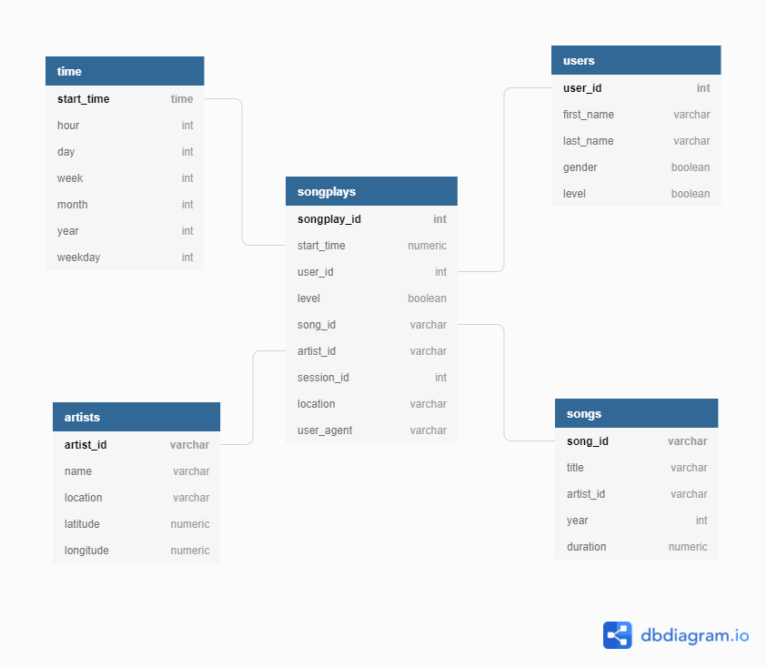

# Project Description

This project's goal is to get familiar with data modeling in PostgreSQL and performing ETL jobs in Python. First, we define fact and dimension tables for a star schema for a particular analytic focus, and write an ETL pipeline that transfers data from files in two local directories into these tables in Postgres using Python and SQL.

Imagine the following scenario:

*A startup called Sparkify wants to analyze the data they've been collecting on songs and user activity on their new music streaming app. The analytics team is particularly interested in understanding what songs users are listening to. Currently, they don't have an easy way to query their data, which resides in a directory of JSON logs on user activity on the app, as well as a directory with JSON metadata on the songs in their app.*

*They'd like a data engineer to create a Postgres database with tables designed to optimize queries on song play analysis, and bring you on the project. Your role is to create a database schema and ETL pipeline for this analysis. You'll be able to test your database and ETL pipeline by running queries given to you by the analytics team from Sparkify and compare your results with their expected results.*


## Data Model 

Below you can see the ERD diagram with star schema for this project. I created this picture using https://dbdiagram.io/ website for free. The file "ERD.txt" contains the instructions on how to recreate such a diagram directly in the website. 

- Fact table: songplays

- Dimension tables: time, artists, users, songs

The schema is optimized for queries on song play analysis.



## Structure of the project
```bash
├── data
│   ├── log_data
│   │   └── 2018
│   │       └── 11
│   └── song_data
│       └── A
│           ├── A
│           │   ├── A
│           │   ├── B
│           │   └── C
│           └── B
│               ├── A
│               ├── B
│               └── C
├── notebooks
├── pictures
├── __pycache__
└── scripts
    ├── __pycache__
    ├── python
    │   └── __pycache__
    └── shell
```

- data: contains the raw data in .json format
- scripts: contains python scripts and shell script 
- notebooks: jupyter notebooks with exploratory etl and tests to check the correctness of SQL queries
- pictures: pictures used to describe the project better: ERD diagram, log-data (head)

## Raw data

### Song Dataset
The first dataset is a subset of real data from the Million Song Dataset. Each file is in JSON format and contains metadata about a song and the artist of that song. The files are partitioned by the first three letters of each song's track ID. 
For example, here are filepaths to two files in this dataset:
```song_data/A/B/C/TRABCEI128F424C983.json```
```song_data/A/A/B/TRAABJL12903CDCF1A.json```

And below is an example of what a single song file, TRAABJL12903CDCF1A.json, looks like:
```{"num_songs": 1, "artist_id": "ARJIE2Y1187B994AB7", "artist_latitude": null, "artist_longitude": null, "artist_location": "", "artist_name": "Line Renaud", "song_id": "SOUPIRU12A6D4FA1E1", "title": "Der Kleine Dompfaff", "duration": 152.92036, "year": 0}```

### Log Dataset

The second dataset consists of log files in JSON format generated by this event simulator based on the songs in the dataset above. These simulate activity logs from a music streaming app based on specified configurations.

The log files in the dataset you'll be working with are partitioned by year and month. 
For example, here are filepaths to two files in this dataset:
```log_data/2018/11/2018-11-12-events.json```
```log_data/2018/11/2018-11-13-events.json```

And below is an example of what the data in a log file, 2018-11-12-events.json (json parsed using read_json method from pandas libary), looks like:


## SQL queries

In the scripts/python/sql_queries.py you will find the queries passed as a list to other scripts and notebooks through 'from sql_queries import \*' statement. The queries perform the following operations:

1) drop tables if they already exist
2) create the tables according to the schema defined above
3) populate the tables with data
4) search for the song_id and artist_id based on song_title, artist_name and duration passed from script/notebook 

## Create tables

create_tables.py script performs the following operations:

- Drops (if exists) and Creates the sparkify database. 
    
- Establishes connection with the sparkify database and gets cursor to it.  
    
- Drops all the tables.  
    
- Creates all tables needed. 
    
- Finally, closes the connection. 

## ETL Job

1) Process song_data:

    - Extract and Insert Data for Songs Table

    - Extract and Insert Data for Artists Table

2) Process log_data:

    - Extract and Insert Data for Time Table

    - Extract and Insert Data for Users Table

    - Extract and Insert Data and Songplays Table

#### 'etl.ipynb' contains a detailed description of each of these steps
#### 'etl.py' is the script executing all the pre-processing and queries necessary to populate the tables 


## Quick start

1) Install Anaconda and create a new virtual environment with python3.8 with the following commands: 

2) Run the shell script "run_scripts.sh" to install the requirements and create the schema, tables, populate the tables with data. Open the terminal window (Linux) and run the following command: ./scripts/shell/run_scripts.sh

3) Go to notebooks directory and run the tests.ipynb jupyter notebook. Run the cells to test the correctness queries